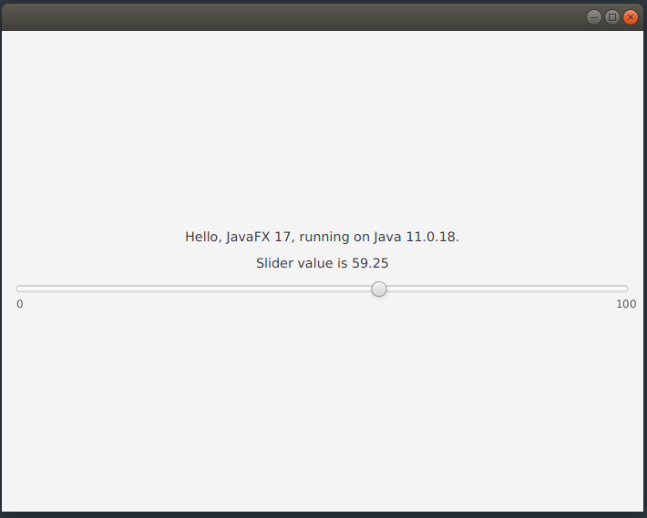
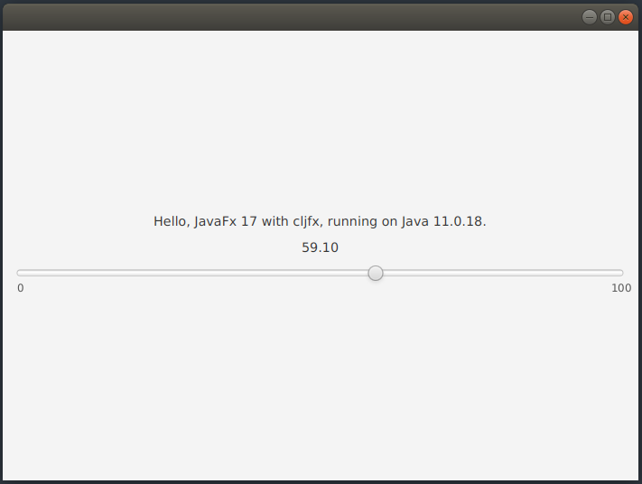

# sample-clojurephant-cljfx-app

Sample project using [clojurephant](https://github.com/clojurephant) to build a Clojure JavaFX application.

## Usage

Run the project's cljfx app directly:

```
$ ./gradlew runShadow
```

Run the project's pure JavaFX app directly:
```
$ ./gradlew run -PchooseMain=SliderView
```

Run the project's tests:

```
$ ./gradlew test
```

Run the project's Clojure REPL:
```
$ ./gradlew clojureRepl
```

## Screenshots

JavaFX App             |  Cljfx App
:-------------------------:|:-------------------------:
  |  